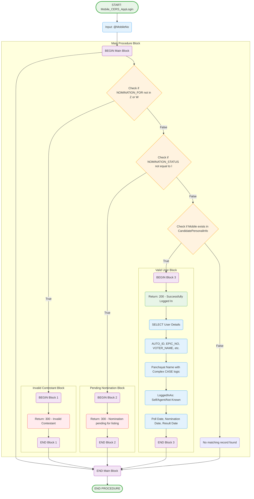

# Mobile_CERS_AppLogin Stored Procedure

## Purpose
Validates user login credentials by checking mobile number against candidate database and returns user details if valid.

## Parameters
- `@MobileNo` (char(10)) - Mobile number to validate

## Logic Flow

## Business Logic

### Validation Checks (in order):
1. **Invalid Contestant Check**: If `NOMINATION_FOR` is 'Z' or 'W', return error 300
2. **Nomination Status Check**: If `NOMINATION_STATUS` is not 'l' (legally valid), return error 300  
3. **User Existence Check**: If mobile number exists in database, proceed with login

### Success Response (Status 200):
Returns comprehensive user information including:
- Personal details (AUTO_ID, EPIC_NO, VOTER_NAME, etc.)
- Contact information (EMAIL_ID, MOBILE_NUMBER)
- Agent details (AgentName, AgentMobile)
- Location information with complex formatting logic
- Login type identification (Self/Agent/Not Known)
- Important dates (Poll Date, Nomination Date, Result Date)
- Post code and limit amount information

### Location Name Logic:
Complex CASE statement to format Panchayat names based on panchayat_code:
- If last 3 digits = 999: District level (Nagar Panchayat)
- If last 3 digits 990-998: MC Ward with number
- Otherwise: Standard Panchayat format

### Date Calculations:
- Poll Date from election master
- Result Date based on nomination type (Z/S uses ZpPsResultDate, others use ResultDate)
- Result Date + 30 days calculation for submission deadline

## Error Codes
- **300**: Invalid Contestant or Pending Nomination
- **200**: Successful Login

## Tables Accessed
- `sec.CandidatePersonalInfo` - Main candidate data
- `sec.Panchayat` - Location information  
- `sec.Block` - Block/Ward information
- `sec.District` - District information
- `sec.electionmaster` - Election and poll dates
- `sec.LimitMaster` - Expenditure limits
- `sec.Code` - Nomination type descriptions
