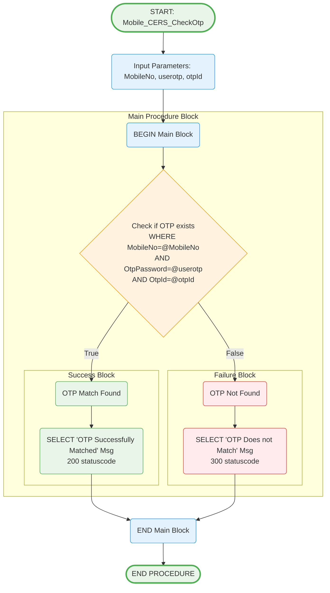

# Mobile_CERS_CheckOtp Stored Procedure

## Purpose
Validates user-entered OTP against stored OTP for authentication verification.

## Parameters
- `@MobileNo` (char(10)) - Mobile number for OTP verification
- `@userotp` (int) - User-entered OTP to validate
- `@otpId` (int) - OTP identifier for matching

## Logic Flow

## Business Logic

### Validation Process:
1. **OTP Lookup**: Searches for exact match in Mobile_CERS_Otp table
2. **Triple Validation**: Matches MobileNo, OtpPassword, and OtpId simultaneously
3. **Binary Response**: Returns success (200) or failure (300) status

### Response Codes:
- **200**: OTP Successfully Matched - Authentication successful
- **300**: OTP Does not Match - Authentication failed

### Security Features:
- **Exact Match Required**: All three parameters must match exactly
- **No Partial Matches**: Prevents brute force attacks
- **Clear Status Codes**: Standardized response format

## Tables Accessed
- `[sec].[Mobile_CERS_Otp]` - OTP storage and verification table

## Usage Context
This procedure is typically called after:
1. User receives OTP via Mobile_CERS_SaveOtp_New
2. User enters OTP in mobile application
3. Application calls this procedure for verification
4. On success, proceeds to token generation

## Error Handling
- Simple binary logic - either match or no match
- No exceptions thrown - always returns a result
- Clear messaging for both success and failure scenarios
