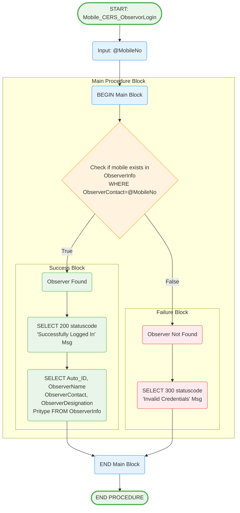

# Mobile_CERS_ObservorLogin Stored Procedure

## Purpose
Authenticates observer users and returns their profile information for observer dashboard access.

## Parameters
- `@MobileNo` (char(10)) - Observer mobile number for authentication

## Logic Flow

## Business Logic

### Authentication Process:
1. **Observer Lookup**: Searches ObserverInfo table for matching mobile number
2. **Profile Retrieval**: Returns complete observer profile on successful match
3. **Error Handling**: Clear rejection message for invalid credentials

### Response Data:
- **Status Response**: statuscode and message
- **Profile Data**: Auto_ID, ObserverName, ObserverContact, ObserverDesignation, Pritype

### Response Codes:
- **200**: Successfully Logged In - Authentication successful
- **300**: Invalid Credentials - Observer not found

## Tables Accessed
- `secExpense.sec.ObserverInfo` - Observer authentication and profile data

## Usage Context
This procedure is called for observer authentication:
1. Observer enters mobile number
2. System calls Mobile_getusertype to identify as observer
3. System calls this procedure for observer-specific login
4. On success, observer gains access to observation dashboard
5. Observer can then view candidate expenditure data

## Security Features
- **Single Table Authentication**: Dedicated observer table lookup
- **Profile Integration**: Authentication and profile retrieval in one call
- **Clear Error Messages**: Explicit invalid credential handling

## Observer Workflow Integration
After successful login, observers typically:
1. Access observer dashboard
2. Select ward/constituency
3. View candidate expenditure details
4. Add remarks and observations
