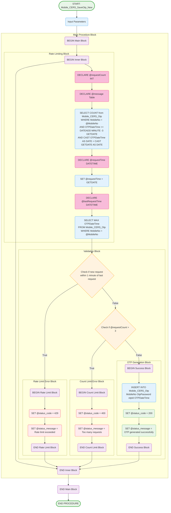

# Mobile_CERS_SaveOtp_New Stored Procedure

## Purpose
Generates and saves OTP for user authentication with rate limiting and validation checks.

## Parameters
- `@MobileNo` (char(10)) - Mobile number for OTP generation
- `@Otppassword` (int) - Generated OTP value
- `@otpId` (int) - OTP identifier
- `@status_code` (int) - OUTPUT parameter for status code
- `@status_message` (varchar(200)) - OUTPUT parameter for status message

## Logic Flow

## Business Logic

### Rate Limiting Rules:
1. **Time-based Limit**: No more than 1 OTP request per minute
2. **Count-based Limit**: Maximum 3 OTP requests per 3-minute window per day
3. **Date-based Reset**: Counters reset daily

### Validation Process:
1. **Check Last Request Time**: Prevents spam requests within 1 minute
2. **Check Request Count**: Counts requests in last 3 minutes for current date
3. **Generate OTP**: If all validations pass, insert new OTP record

### Output Parameters:
- **@status_code**: 
  - 200: Success
  - 400: Too many requests (>3 in 3 minutes)
  - 429: Rate limit exceeded (within 1 minute)
- **@status_message**: Descriptive message for the status

## Tables Accessed
- `[sec].[Mobile_CERS_Otp]` - OTP storage and tracking table

## Security Features
- **Rate Limiting**: Prevents brute force attacks
- **Time Windows**: Multiple time-based restrictions
- **Daily Reset**: Counters reset each day
- **Audit Trail**: All OTP requests logged with timestamps

## Error Handling
- Comprehensive validation before OTP generation
- Clear error messages for different failure scenarios
- Output parameters for API response handling
