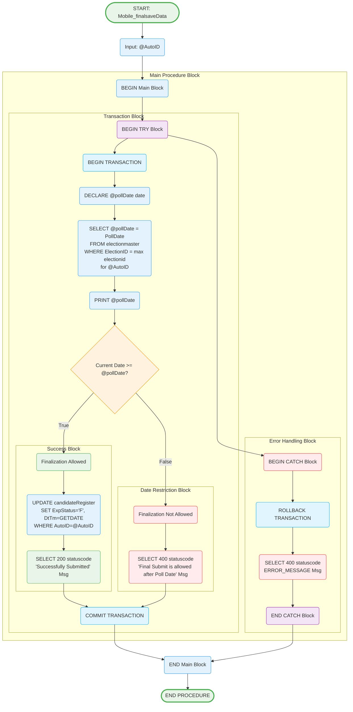

# Mobile_finalsaveData Stored Procedure

## Purpose
Finalizes candidate expenditure data by updating status from pending to final, with poll date validation and transaction management.

## Parameters
- `@AutoID` (bigint) - Candidate identifier for finalization

## Logic Flow

## Business Logic

### Finalization Rules:
1. **Poll Date Validation**: Final submission only allowed after poll date
2. **Status Update**: Changes ExpStatus from 'P' (Pending) to 'F' (Final)
3. **Timestamp Update**: Records finalization time with GETDATE()
4. **Transaction Safety**: All operations wrapped in transaction

### Date Validation Process:
1. **Poll Date Lookup**: Retrieves poll date from election master
2. **Election ID Resolution**: Uses maximum election ID for the candidate
3. **Date Comparison**: Current date must be >= poll date
4. **Enforcement**: Blocks early finalization attempts

### Response Codes:
- **200**: Successfully Submitted - Finalization completed
- **400**: Date restriction error or system error

## Tables Accessed
- `sec.sec.electionmaster` - Election and poll date information
- `sec.sec.CandidatePersonalInfo` - Candidate election mapping
- `sec.candidateRegister` - Expenditure records to finalize

## Transaction Management
- **BEGIN TRANSACTION**: Ensures data consistency
- **COMMIT**: On successful completion
- **ROLLBACK**: On any error or exception
- **TRY-CATCH**: Comprehensive error handling

## Usage Context
This procedure is called when:
1. Candidate has completed all expenditure entries
2. Poll date has passed
3. Candidate wants to finalize submission
4. System needs to lock expenditure data from further changes

## Security Features
- **Date Enforcement**: Prevents premature finalization
- **Transaction Integrity**: Atomic operations
- **Error Logging**: Detailed error messages
- **Status Tracking**: Clear audit trail with timestamps

## Business Impact
After finalization:
- Expenditure data becomes read-only
- Data is available for observer review
- Reports can include finalized amounts
- Compliance requirements are met
