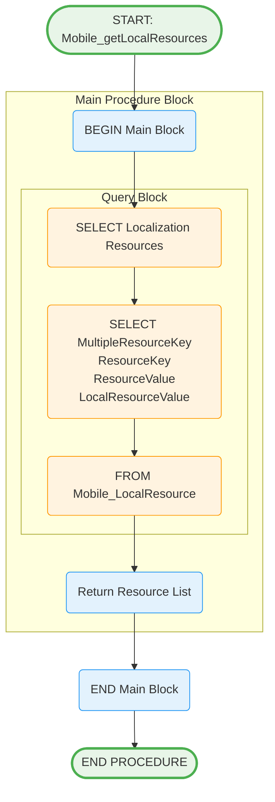

# Mobile_getLocalResources Stored Procedure

## Purpose
Retrieves localization resources for mobile application UI elements, supporting multi-language functionality.

## Parameters
None - Returns all localization resources

## Logic Flow

## Business Logic

### Data Retrieval:
- **Complete Resource Set**: Returns all localization resources
- **Multi-language Support**: Both default and local language values
- **Key-Value Structure**: Organized by resource keys for easy lookup

### Response Fields:
- **MultipleResourceKey**: Grouping identifier for related resources
- **ResourceKey**: Unique identifier for each resource
- **ResourceValue**: Default language text (typically English)
- **LocalResourceValue**: Local language translation

## Tables Accessed
- `sec.Mobile_LocalResource` - Localization resource master data

## Usage Context
This procedure supports mobile app localization:
1. **App Initialization**: Load all text resources
2. **Language Switching**: Provide translations for UI elements
3. **Offline Support**: Cache resources locally on mobile device
4. **Dynamic Content**: Support runtime language changes

## Integration Points
- **Mobile App Startup**: Download and cache resources
- **UI Rendering**: Display appropriate language text
- **Settings Management**: Support language preference changes
- **Content Management**: Update translations without app updates
