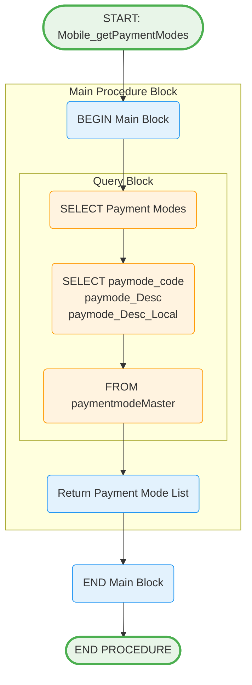

# Mobile_getPaymentModes Stored Procedure

## Purpose
Retrieves all available payment modes with descriptions in both English and local language for dropdown/selection lists.

## Parameters
None - Returns all payment modes

## Logic Flow

## Business Logic

### Data Retrieval:
- **Simple Master Data Query**: Returns all available payment modes
- **No Filtering**: All active payment modes included
- **Dual Language Support**: English and local language descriptions

### Response Fields:
- **paymode_code**: Unique payment mode identifier
- **paymode_Desc**: English description
- **paymode_Desc_Local**: Local language description

## Tables Accessed
- `[sec].[paymentmodeMaster]` - Payment mode master data

## Usage Context
This procedure is typically called during:
1. **App Initialization**: Load payment mode options
2. **Expenditure Entry**: Populate payment mode dropdown
3. **Data Entry Forms**: Provide selection options
4. **Reference Data Sync**: Update local mobile database

## Integration Points
- **Mobile App Dropdowns**: Payment mode selection lists
- **Form Validation**: Ensure valid payment mode codes
- **Local Database Sync**: Update mobile app reference data
- **Multi-language Support**: Display appropriate language based on user preference

## Performance Characteristics
- **Lightweight Query**: Simple SELECT with no joins
- **Master Data**: Relatively small dataset
- **No Parameters**: No query optimization needed
- **Fast Execution**: Suitable for frequent calls
