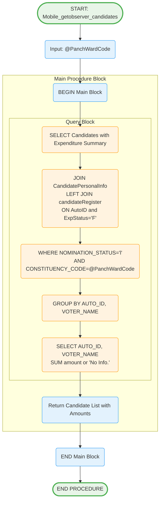

# Mobile_getobserver_candidates Stored Procedure

## Purpose
Retrieves candidate list with expenditure summary for a specific panchayat/ward for observer review.

## Parameters
- `@PanchWardCode` (char(10)) - Panchayat or ward code to get candidates for

## Logic Flow

## Business Logic

### Data Retrieval Process:
1. **Candidate Filtering**: Only legally nominated candidates (NOMINATION_STATUS='l')
2. **Constituency Matching**: Filters by specific panchayat/ward code
3. **Expenditure Summary**: Aggregates finalized expenditure amounts (ExpStatus='F')
4. **Null Handling**: Shows 'No Info.' for candidates with no expenditure data

### Query Structure:
- **Main Table**: sec.CandidatePersonalInfo (candidate details)
- **Join Table**: secExpense.sec.candidateRegister (expenditure data)
- **Join Condition**: AutoID match + ExpStatus='F' (finalized only)
- **Grouping**: By candidate (AUTO_ID, VOTER_NAME)

### Response Fields:
- **AUTO_ID**: Unique candidate identifier
- **VOTER_NAME**: Candidate name
- **Amount**: Total expenditure amount or 'No Info.'

## Tables Accessed
- `sec.sec.CandidatePersonalInfo` - Candidate personal information
- `secExpense.sec.candidateRegister` - Expenditure records

## Usage Context
This procedure is used in observer workflow:
1. Observer logs in successfully
2. Observer selects ward/constituency from dashboard
3. System calls this procedure to get candidate list
4. Observer can then select specific candidate to view detailed expenditure
5. Observer can add remarks for selected candidates

## Data Filtering Rules
- **Nomination Status**: Only 'l' (legally valid) candidates
- **Expenditure Status**: Only 'F' (finalized) expenditure records
- **Constituency Match**: Exact match with provided panchayat/ward code
- **Aggregation**: SUM of all finalized expenditure amounts per candidate

## Observer Dashboard Integration
Results feed into observer interface for:
- Candidate selection dropdown/list
- Expenditure amount preview
- Navigation to detailed expenditure view
- Basis for adding observer remarks
