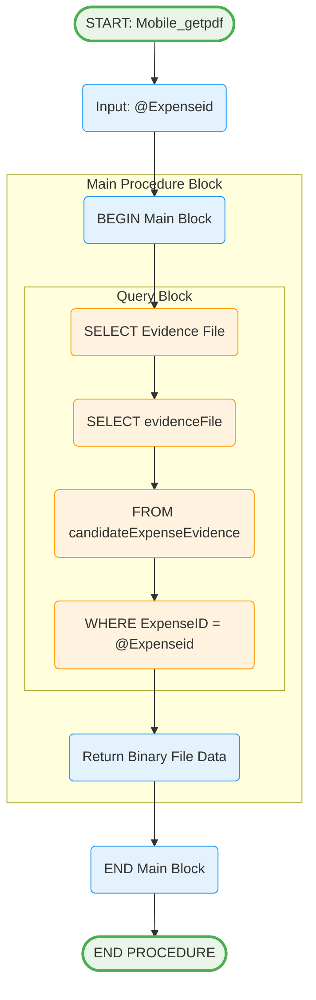

# Mobile_getpdf Stored Procedure

## Purpose
Retrieves evidence file binary data for a specific expense record to support file download and display functionality.

## Parameters
- `@Expenseid` (bigint) - Expense identifier to retrieve evidence file for

## Logic Flow

## Business Logic

### File Retrieval:
- **Direct Binary Access**: Returns raw varbinary data
- **Single Record**: Retrieves evidence for specific expense
- **No Processing**: Returns file as-is for client handling

### Response Data:
- **evidenceFile**: Binary file content (varbinary(max))
- **Null Handling**: Returns null if no evidence file exists

## Tables Accessed
- `[sec].[candidateExpenseEvidence]` - Evidence file storage

## Usage Context
This procedure supports file operations:
1. **File Download**: Retrieve evidence files for viewing
2. **Mobile Display**: Show attached documents/images
3. **Audit Trail**: Access supporting documentation
4. **Compliance**: Provide evidence for expenditure claims

## File Handling
- **Binary Data**: Returns complete file content
- **Format Agnostic**: Supports any file type (PDF, images, documents)
- **Size Considerations**: varbinary(max) supports large files
- **Client Processing**: File type detection handled by client application

## Integration Points
- **Mobile File Viewer**: Display evidence files
- **Download Functionality**: Save files to device
- **Document Management**: Access attached evidence
- **Audit Systems**: Retrieve supporting documentation
