# Mobile_getsaveData Stored Procedure

## Purpose
Retrieves comprehensive expenditure data for a candidate with formatted dates, descriptions, and evidence file indicators.

## Parameters
- `@AutoID` (bigint) - Candidate identifier to retrieve expenditure data for

## Logic Flow

```mermaid
flowchart TD
    Start([START: Mobile_getsaveData]) --> Input(Input: @AutoID)
    
    Input --> MainBegin(BEGIN Main Block)
    
    subgraph "Main Procedure Block"
        MainBegin --> QueryData(SELECT Expenditure Data with Joins)
        
        subgraph "Query Block"
            QueryData --> MainTable(FROM candidateRegister c)
            MainTable --> Join1(LEFT JOIN expenseSourceMaster s<br/>ON Exp_code = expCode)
            Join1 --> Join2(LEFT JOIN paymentmodeMaster m<br/>ON paymode_code = payMode)
            Join2 --> Join3(LEFT JOIN candidateExpenseEvidence e<br/>ON ExpenseID match)
            Join3 --> Join4(LEFT JOIN OberverRemarks o<br/>ON ExpenseID match)
            Join4 --> FilterData(WHERE AutoID = @AutoID)
            FilterData --> OrderData(ORDER BY DtTm DESC)
        end
        
        subgraph "Data Processing"
            OrderData --> FormatDates(Format expDate and paymentDate<br/>Both 120 and 103 formats)
            FormatDates --> FormatAmounts(Cast amounts as bigint)
            FormatAmounts --> FormatTimestamp(Format DtTm as date + time)
            FormatTimestamp --> ProcessEvidence(Check evidenceFile existence<br/>Return Y or F)
            ProcessEvidence --> TrimDescriptions(Trim expense and payment descriptions<br/>Both English and Local)
        end
        
        TrimDescriptions --> ReturnResults(Return Complete Dataset)
    end
    
    ReturnResults --> MainEnd(END Main Block)
    MainEnd --> Finish([END PROCEDURE])

    %% Styling
    classDef startEnd fill:#e8f5e8,stroke:#4caf50,stroke-width:3px
    classDef process fill:#e3f2fd,stroke:#2196f3
    classDef query fill:#fff3e0,stroke:#ff9800
    classDef join fill:#f3e5f5,stroke:#9c27b0
    classDef format fill:#e1f5fe,stroke:#03a9f4
    
    class Start,Finish startEnd
    class Input,MainBegin,ReturnResults,MainEnd process
    class QueryData,MainTable,FilterData,OrderData query
    class Join1,Join2,Join3,Join4 join
    class FormatDates,FormatAmounts,FormatTimestamp,ProcessEvidence,TrimDescriptions format
```

## Business Logic

### Data Retrieval Strategy:
1. **Main Record**: candidateRegister as primary source
2. **Master Data Joins**: Expense source and payment mode descriptions
3. **Evidence Check**: Indicates if evidence file exists
4. **Observer Integration**: Includes observer remarks if available

### Date Formatting:
- **expDate**: Both ISO (120) and DD/MM/YYYY (103) formats
- **paymentDate**: Both ISO (120) and DD/MM/YYYY (103) formats  
- **DtTm**: Custom format combining date (103) and 12-hour time

### Amount Processing:
- **amount**: Cast as bigint for display
- **amountoutstanding**: Cast as bigint for display

### Evidence File Handling:
- **Y**: Evidence file exists
- **F**: No evidence file attached

## Response Fields
- **ExpenseID**: Unique expense identifier
- **AutoID**: Candidate identifier
- **expDate/expDateDisplay**: Expenditure date (ISO/Display)
- **paymentDate/paymentDateDisplay**: Payment date (ISO/Display)
- **expCode**: Expense type code
- **amtType**: Amount type indicator
- **amount**: Expenditure amount
- **amountoutstanding**: Outstanding amount
- **voucherBillNumber**: Voucher/bill reference
- **payMode**: Payment mode code
- **payeeName/payeeAddress**: Payee information
- **sourceMoney**: Source of funds
- **remarks**: Additional notes
- **DtTm**: Formatted timestamp
- **ExpStatus**: Current status (P/F)
- **ExpTypeName/ExpTypeNameLocal**: Expense descriptions
- **PayModeName/PayModeNameLocal**: Payment mode descriptions
- **evidenceFile**: Evidence indicator (Y/F)
- **ObserverRemarks**: Observer comments

## Tables Accessed
- `sec.candidateRegister` - Main expenditure records
- `sec.expenseSourceMaster` - Expense type descriptions
- `sec.paymentmodeMaster` - Payment mode descriptions
- `sec.candidateExpenseEvidence` - Evidence file tracking
- `sec.OberverRemarks` - Observer comments

## Usage Context
This procedure supports multiple scenarios:
1. **Dashboard Display**: Show candidate's expenditure summary
2. **Edit Preparation**: Load existing data for modification
3. **Review Process**: Display data for verification
4. **Observer View**: Show expenditure with observer remarks

## Data Ordering
- **ORDER BY DtTm DESC**: Most recent entries first
- **Chronological View**: Latest modifications appear at top

## Localization Support
- **Dual Language**: English and local language descriptions
- **Master Data Integration**: Standardized terminology across system
