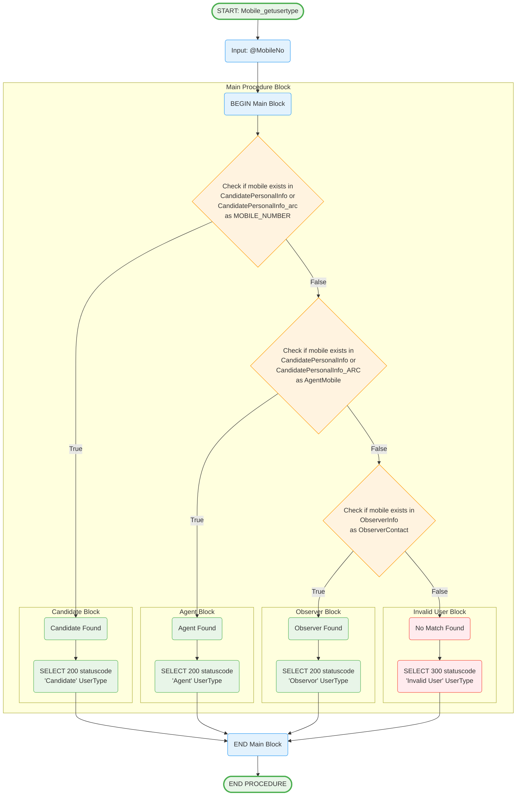

# Mobile_getusertype Stored Procedure

## Purpose
Determines user type (Candidate, Agent, Observer, or Invalid) based on mobile number lookup across multiple tables.

## Parameters
- `@MobileNo` (char(10)) - Mobile number to check user type

## Logic Flow

## Business Logic

### User Type Hierarchy (Priority Order):
1. **Candidate**: Primary mobile number in candidate tables
2. **Agent**: Agent mobile number in candidate tables  
3. **Observer**: Mobile number in observer info table
4. **Invalid User**: No match found in any table

### Validation Rules:
- **Candidate Check**: Searches both active and archived candidate tables
- **Agent Check**: Searches both active and archived candidate tables for agent mobile
- **Observer Check**: Searches observer info table
- **Cascading Logic**: Stops at first match found

### Response Format:
- **statuscode**: 200 (valid user) or 300 (invalid user)
- **UserType**: 'Candidate', 'Agent', 'Observor', or 'Invalid User'

## Tables Accessed
- `sec.CandidatePersonalInfo` - Active candidate data
- `sec.CandidatePersonalInfo_arc` - Archived candidate data  
- `sec.CandidatePersonalInfo_ARC` - Additional archived candidate data
- `secExpense.sec.ObserverInfo` - Observer information

## Usage Context
This procedure is typically the first step in authentication:
1. User enters mobile number
2. System calls this procedure to determine user type
3. Based on user type, different authentication flows are triggered
4. Candidates/Agents proceed to OTP flow
5. Observers proceed to observer login flow

## Security Features
- **Multiple Table Search**: Comprehensive user lookup
- **Archive Support**: Includes historical data
- **Clear Classification**: Unambiguous user type identification
- **Invalid User Handling**: Explicit rejection of unknown numbers
