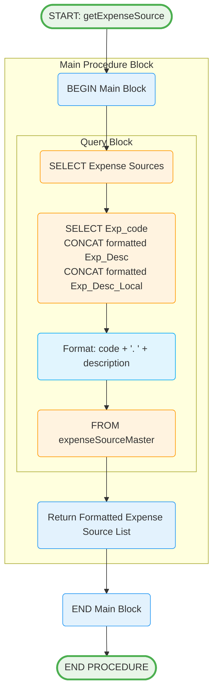

# getExpenseSource Stored Procedure

## Purpose
Retrieves expense source master data with formatted descriptions including sequence numbers for dropdown lists and reference data.

## Parameters
None - Returns all expense sources

## Logic Flow

## Business Logic

### Data Formatting:
- **Code Conversion**: Casts Exp_code to integer for display
- **Description Formatting**: Combines code number with description text
- **Dual Language**: Formats both English and local language descriptions
- **Consistent Structure**: "1. Description" format for user-friendly display

### Response Fields:
- **Exp_code**: Original expense code identifier
- **Exp_Desc**: Formatted English description (e.g., "1. Travel Expenses")
- **Exp_Desc_Local**: Formatted local language description

## Tables Accessed
- `[secExpense].[sec].[expenseSourceMaster]` - Expense source master data

## Usage Context
This procedure provides reference data for:
1. **Expenditure Entry Forms**: Expense type dropdown lists
2. **Mobile App Initialization**: Load expense source options
3. **Data Validation**: Ensure valid expense codes
4. **User Interface**: Display user-friendly expense categories

## Formatting Logic
- **CONCAT Function**: Combines code and description
- **Integer Casting**: Converts code to readable number
- **Separator**: Uses '. ' (dot space) between code and description
- **Example Output**: "001" becomes "1. Office Supplies"

## Integration Points
- **Mobile Dropdowns**: Expense category selection
- **Form Validation**: Valid expense type checking
- **Local Database Sync**: Update mobile reference data
- **Multi-language UI**: Support localized expense categories
