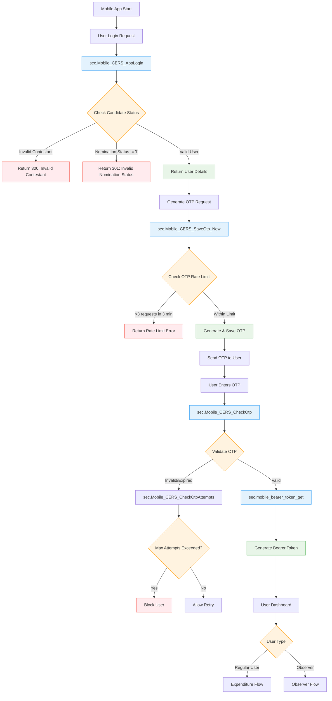
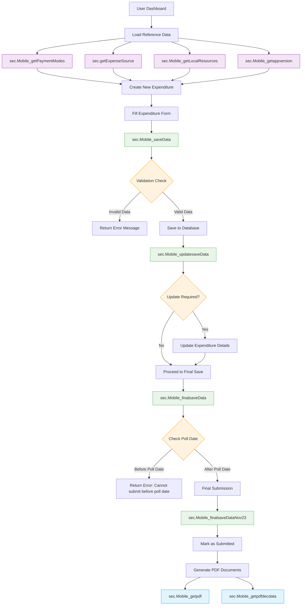
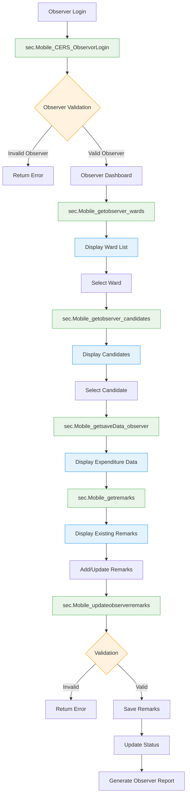
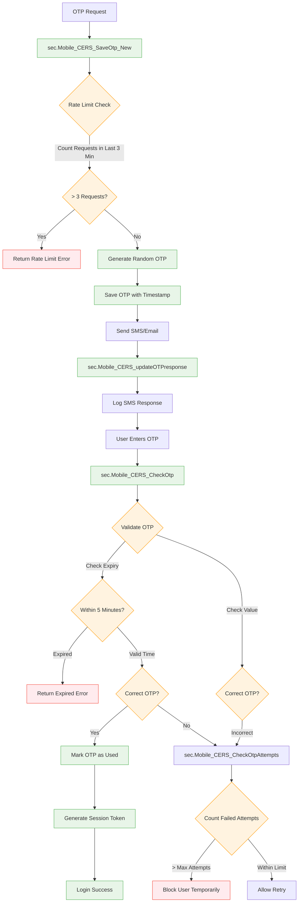
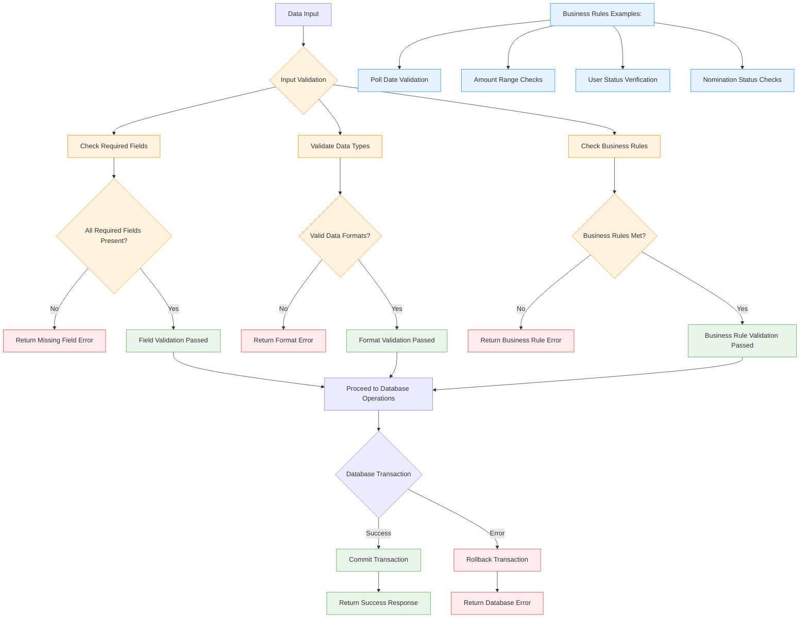

# CERS Stored Procedure Flow Diagrams

## Complete Application Flow with Business Logic

## Expenditure Management Flow

## Observer Workflow

## OTP Management Flow

## Data Validation & Business Rules

## Key Business Logic Insights

### Authentication Flow
- **Rate Limiting**: Maximum 3 OTP requests per 3 minutes per mobile number
- **OTP Expiry**: OTPs expire after 5 minutes
- **Attempt Limiting**: Failed OTP attempts are tracked and users can be temporarily blocked
- **Candidate Validation**: Users must have valid nomination status ('l') to login

### Expenditure Management
- **Poll Date Restriction**: Final submissions only allowed after poll date
- **Data Validation**: Multiple validation layers for expenditure data
- **File Attachments**: Support for evidence file uploads (Base64 encoded)
- **Audit Trail**: All changes are tracked with timestamps and user information

### Observer Workflow
- **Hierarchical Access**: Observers can only view wards assigned to them
- **Candidate Filtering**: Ward-based candidate filtering for focused review
- **Remark System**: Comprehensive remark and approval system
- **Status Tracking**: Real-time status updates for expenditure reviews

### Data Integrity
- **Transaction Management**: All critical operations use database transactions
- **Error Handling**: Comprehensive error handling with specific error codes
- **Logging**: Detailed logging for audit and debugging purposes
- **Rollback Capability**: Failed operations are properly rolled back to maintain data consistency
