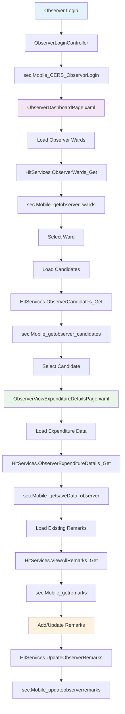
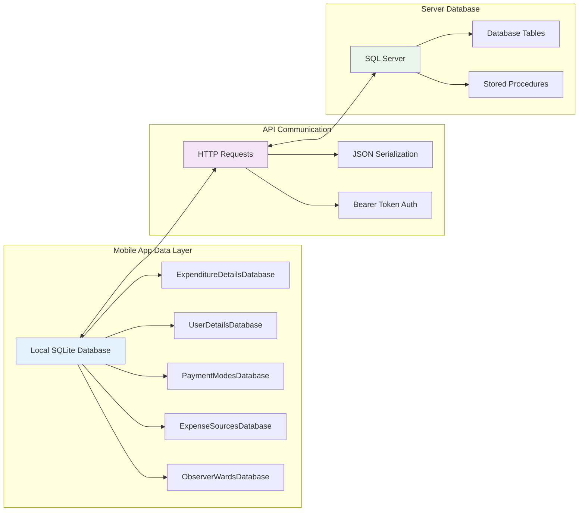
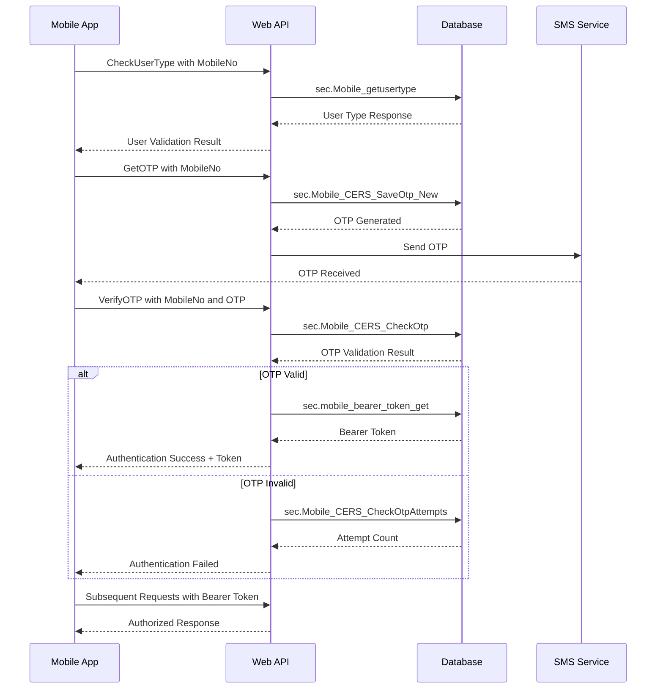
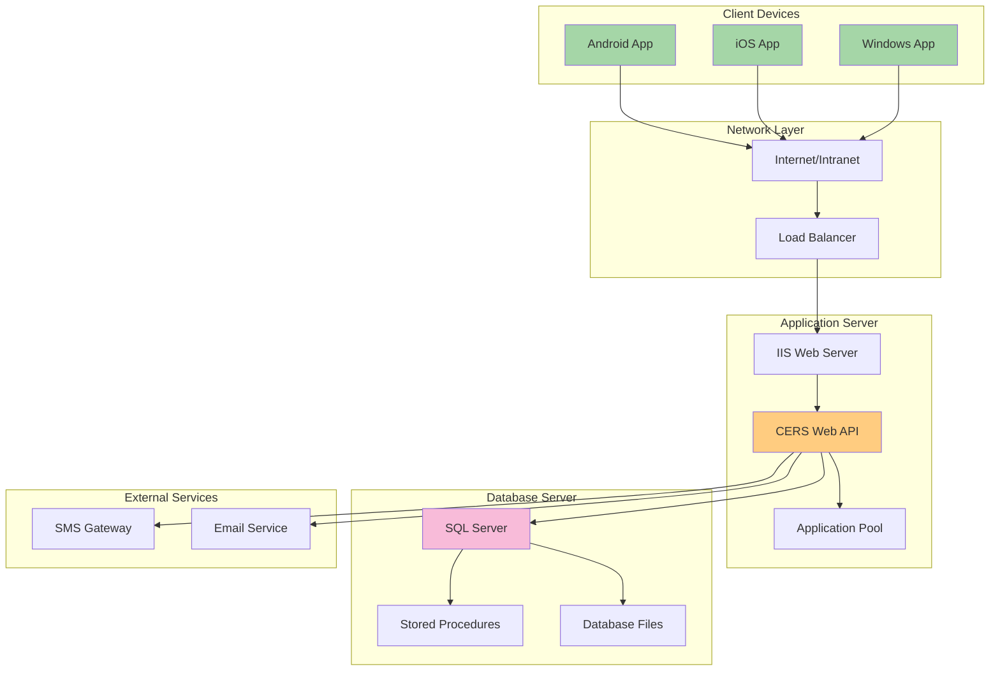

# CERS Complete System Architecture & Flow

## System Overview

The CERS (Candidate Election Reporting System) consists of three main components:
1. **Mobile App (CERS)** - .NET MAUI cross-platform application
2. **Web API (CERSWebApi)** - ASP.NET Web API backend
3. **Database Layer** - SQL Server with stored procedures

## Complete System Architecture

```mermaid
graph TB
    subgraph "Mobile Application Layer"
        A[CERS Mobile App]
        A1[LoginPage.xaml]
        A2[DashboardPage.xaml]
        A3[AddExpenditureDetailsPage.xaml]
        A4[EditExpenditureDetailsPage.xaml]
        A5[ViewExpenditureDetailsPage.xaml]
        A6[Observer Pages]
        
        A --> A1
        A --> A2
        A --> A3
        A --> A4
        A --> A5
        A --> A6
    end
    
    subgraph "Service Layer"
        B[HitServices.cs]
        B1[HTTP Client]
        B2[Authentication]
        B3[Data Serialization]
        B4[Local Database]
        
        B --> B1
        B --> B2
        B --> B3
        B --> B4
    end
    
    subgraph "Web API Layer"
        C[CERSWebApi]
        C1[UserLoginController]
        C2[ExpenditureDetailsController]
        C3[ObserverController]
        C4[GetOTPController]
        C5[CheckOtpController]
        C6[GenerateTokenController]
        
        C --> C1
        C --> C2
        C --> C3
        C --> C4
        C --> C5
        C --> C6
    end
    
    subgraph "Data Access Layer"
        D[DBAccess.cs]
        D1[getDBData]
        D2[getDBDataSet]
        D3[Connection Management]
        
        D --> D1
        D --> D2
        D --> D3
    end
    
    subgraph "Database Layer"
        E[SQL Server Database]
        E1[sec.Mobile_CERS_AppLogin]
        E2[sec.Mobile_saveData]
        E3[sec.Mobile_CERS_SaveOtp_New]
        E4[sec.Mobile_CERS_CheckOtp]
        E5[sec.mobile_bearer_token_get]
        E6[25+ Stored Procedures]
        
        E --> E1
        E --> E2
        E --> E3
        E --> E4
        E --> E5
        E --> E6
    end
    
    A1 --> B
    A2 --> B
    A3 --> B
    A4 --> B
    A5 --> B
    A6 --> B
    
    B --> C
    C --> D
    D --> E
    
    style A fill:#e3f2fd
    style B fill:#f3e5f5
    style C fill:#e8f5e8
    style D fill:#fff3e0
    style E fill:#fce4ec
```

## Complete User Journey Flow

```mermaid
flowchart TD
    Start([User Opens CERS App]) --> Login(LoginPage.xaml)
    
    Login --> MobileEntry(Enter Mobile Number)
    MobileEntry --> GetOTP(btn_getotp_Clicked)
    
    subgraph "User Type Validation"
        GetOTP --> HitService1(HitServices.CheckUserType_Get)
        HitService1 --> API1(UserLoginController/CheckUserType)
        API1 --> SP1(sec.Mobile_getusertype)
        SP1 --> UserTypeCheck{Check Mobile in:<br/>CandidatePersonalInfo<br/>AgentMobile<br/>ObserverInfo}
        UserTypeCheck --> UserTypeResult{User Type?}
    end
    
    UserTypeResult -->|Candidate/Agent| ValidUser(Valid User - Status 200)
    UserTypeResult -->|Observer| ObserverFlow(Observer Login Flow)
    UserTypeResult -->|Invalid| InvalidUser(Invalid User - Status 300)
    
    subgraph "OTP Generation Process"
        ValidUser --> GetOTPAPI(GetOTPController)
        GetOTPAPI --> SP2(sec.Mobile_CERS_SaveOtp_New)
        SP2 --> RateLimit{Check Rate Limits:<br/>Max 1 per minute<br/>Max 3 per 3 minutes}
        RateLimit -->|Allowed| GenerateOTP(Generate 6-digit OTP<br/>Insert into Mobile_CERS_Otp)
        RateLimit -->|Rate Limited| OTPRateError(Status 429 - Rate Limit)
        GenerateOTP --> SMSService(Send OTP via SMS)
        SMSService --> OTPSent(OTP Sent - Status 200)
    end
    
    subgraph "OTP Verification Process"
        OTPSent --> EnterOTP(User Enters OTP)
        EnterOTP --> VerifyOTP(btn_submitotp_Clicked)
        VerifyOTP --> HitService2(HitServices.CheckOtp)
        HitService2 --> API2(CheckOtpController)
        API2 --> SP3(sec.Mobile_CERS_CheckOtp)
        SP3 --> OTPValidation{Validate OTP:<br/>MobileNo + OtpPassword + OtpId}
        OTPValidation -->|Match Found| OTPSuccess(Status 200 - OTP Valid)
        OTPValidation -->|No Match| OTPFailure(Status 300 - OTP Invalid)
    end
    
    subgraph "Token Generation Process"
        OTPSuccess --> TokenGen(GenerateTokenController)
        TokenGen --> SP4(sec.mobile_bearer_token_get)
        SP4 --> TokenProcess(Generate 32-char Token:<br/>Random alphanumeric<br/>using NEWID cryptography)
        TokenProcess --> CleanupTokens(DELETE expired tokens<br/>WHERE expire_datetime < NOW)
        CleanupTokens --> InsertToken(INSERT new token<br/>into mobile_token_master)
        InsertToken --> TokenResult{Token Insert<br/>Successful?}
        TokenResult -->|Success| TokenSuccess(Status 200 - Token Created<br/>Return Bearer Token)
        TokenResult -->|Failed| TokenError(Status 400 - Token Failed)
    end
    
    subgraph "Dashboard Initialization"
        TokenSuccess --> Dashboard(Navigate to DashboardPage.xaml<br/>Store Bearer Token)
        Dashboard --> LoadUserData(Load User Profile Data<br/>from sec.Mobile_CERS_AppLogin)
        LoadUserData --> UserProfile(Get Candidate Details:<br/>VOTER_NAME, EPIC_NO<br/>Panchayat, Election Dates)
        UserProfile --> LoadRefData(Load Reference Data)
        
        LoadRefData --> PayModes(HitServices.PaymentModes_Get)
        LoadRefData --> ExpSources(HitServices.ExpenseSources_Get)
        LoadRefData --> LocalRes(HitServices.LocalResources_Get)
        
        PayModes --> SP5(sec.Mobile_getPaymentModes<br/>Get all payment modes)
        ExpSources --> SP6(sec.getExpenseSource<br/>Get formatted expense types)
        LocalRes --> SP7(sec.Mobile_getLocalResources<br/>Get UI text translations)
        
        SP5 --> RefDataComplete(Reference Data Loaded)
        SP6 --> RefDataComplete
        SP7 --> RefDataComplete
        RefDataComplete --> LoadExistingData(Load Existing Expenditure)
        LoadExistingData --> SP_GetData(sec.Mobile_getsaveData<br/>Get user's expenditure records)
        SP_GetData --> DashboardReady(Dashboard Ready)
    end
    
    subgraph "User Actions"
        DashboardReady --> UserAction{User Action}
        
        UserAction -->|Add Expenditure| AddExp(AddExpenditureDetailsPage.xaml)
        UserAction -->|Edit Expenditure| EditExp(EditExpenditureDetailsPage.xaml)
        UserAction -->|View Expenditure| ViewExp(ViewExpenditureDetailsPage.xaml)
        UserAction -->|Final Submit| FinalSubmit(Final Submission Process)
        
        AddExp --> SaveData(btn_savedata_Clicked)
        SaveData --> HitService3(HitServices.SaveExpenditureDetails<br/>with Bearer Token)
        HitService3 --> API3(ExpenditureDetailsController<br/>Validate Token)
        API3 --> SP8(sec.Mobile_saveData)
        SP8 --> SaveProcess(BEGIN TRANSACTION<br/>Check duplicates<br/>Insert expenditure<br/>Insert evidence if provided)
        SaveProcess --> SaveResult{Save Success?}
        SaveResult -->|Success| SaveSuccess(Status 200 - Saved<br/>COMMIT TRANSACTION)
        SaveResult -->|Error| SaveError(Status 400 - Error<br/>ROLLBACK TRANSACTION)
        
        EditExp --> UpdateData(Update Existing Record)
        UpdateData --> SP9(sec.Mobile_updatesaveData<br/>Update with new values)
        
        FinalSubmit --> SP10(sec.Mobile_finalsaveData<br/>Check poll date validation)
        SP10 --> FinalCheck{Current Date >=<br/>Poll Date?}
        FinalCheck -->|Yes| FinalSuccess(Update ExpStatus to 'F'<br/>Status 200 - Finalized)
        FinalCheck -->|No| FinalError(Status 400 - Too Early)
    end
    
    subgraph "File Operations"
        ViewExp --> PDFGen(Generate Evidence PDF)
        PDFGen --> SP12(sec.Mobile_getpdf<br/>Get evidence file binary)
        SP12 --> FileDownload(Download Evidence File)
    end
    
    %% Error Flows
    InvalidUser --> ErrorDisplay(Show Invalid User Message)
    OTPRateError --> ErrorDisplay
    OTPFailure --> OTPRetry(Allow OTP Retry)
    TokenError --> ErrorDisplay
    SaveError --> UserAction
    FinalError --> UserAction
    
    %% Observer Flow
    ObserverFlow --> ObsAuth(ObserverLoginController)
    ObsAuth --> SP_Obs(sec.Mobile_CERS_ObservorLogin)
    
    %% Styling
    classDef startEnd fill:#e8f5e8,stroke:#4caf50,stroke-width:3px
    classDef process fill:#e3f2fd,stroke:#2196f3
    classDef decision fill:#fff3e0,stroke:#ff9800
    classDef success fill:#e8f5e8,stroke:#4caf50
    classDef error fill:#ffebee,stroke:#f44336
    classDef api fill:#f3e5f5,stroke:#9c27b0
    classDef database fill:#fce4ec,stroke:#e91e63
    classDef token fill:#e1f5fe,stroke:#03a9f4
    
    class Start,DashboardReady startEnd
    class Login,MobileEntry,EnterOTP,Dashboard process
    class UserTypeResult,RateLimit,OTPValidation,TokenResult,UserAction,SaveResult,FinalCheck decision
    class ValidUser,OTPSuccess,TokenSuccess,SaveSuccess,FinalSuccess success
    class InvalidUser,OTPRateError,OTPFailure,TokenError,SaveError,FinalError,ErrorDisplay error
    class API1,API2,API3,GetOTPAPI,TokenGen api
    class SP1,SP2,SP3,SP4,SP5,SP6,SP7,SP8,SP9,SP10,SP12 database
    class TokenProcess,CleanupTokens,InsertToken token
```

## Observer Workflow

## Data Flow Architecture

## Security & Authentication Flow

## Key Components Mapping

### Mobile App Components
- **Pages**: LoginPage, DashboardPage, AddExpenditureDetailsPage, EditExpenditureDetailsPage, ViewExpenditureDetailsPage
- **Observer Pages**: ObserverDashboardPage, ExpenditureDateTypewiselistPage, ObserverViewExpenditureDetailsPage
- **Models**: ExpenditureDetails, UserDetails, PaymentModes, ExpenseSources, ObserverWards, etc.
- **Database Classes**: All models have corresponding Database classes for local SQLite operations
- **Services**: HitServices.cs handles all API communications

### Web API Components
- **Controllers**: 21 controllers handling different functionalities
- **Data Access**: DBAccess.cs provides centralized database operations
- **Authentication**: Token-based authentication with OTP verification
- **File Handling**: Support for evidence file uploads and PDF generation

### Database Components
- **25 Stored Procedures** in the `sec` schema
- **Business Logic**: Embedded in stored procedures for data validation and processing
- **Security**: Role-based access control and data encryption
- **Audit Trail**: Comprehensive logging and tracking mechanisms

## Technology Stack

### Mobile App (CERS)
- **.NET MAUI** - Cross-platform framework
- **XAML** - UI markup language
- **SQLite** - Local database storage
- **Newtonsoft.Json** - JSON serialization
- **HttpClient** - API communication

### Web API (CERSWebApi)
- **ASP.NET Web API** - RESTful web services
- **SQL Server** - Primary database
- **Entity Framework** - Data access (implied)
- **JSON** - Data exchange format
- **IIS** - Web server hosting

### Database
- **SQL Server** - Relational database management system
- **Stored Procedures** - Business logic implementation
- **Triggers** - Data integrity and audit trails
- **Views** - Data presentation layer
- **Functions** - Reusable database logic

## Deployment Architecture

## Performance & Scalability Considerations

### Mobile App Optimizations
- **Local Caching**: SQLite database for offline functionality
- **Lazy Loading**: Data loaded on demand
- **Image Compression**: Evidence files compressed before upload
- **Background Sync**: Data synchronization when network available

### API Optimizations
- **Connection Pooling**: Efficient database connection management
- **Caching**: Frequently accessed data cached in memory
- **Compression**: Response compression for reduced bandwidth
- **Rate Limiting**: OTP request limiting to prevent abuse

### Database Optimizations
- **Indexing**: Proper indexing on frequently queried columns
- **Stored Procedures**: Pre-compiled execution plans
- **Transaction Management**: ACID compliance with proper rollback
- **Partitioning**: Large tables partitioned for better performance

This comprehensive flow diagram represents the complete CERS system architecture, showing how all three components (Mobile App, Web API, and Database) work together to provide a robust candidate election reporting system.
