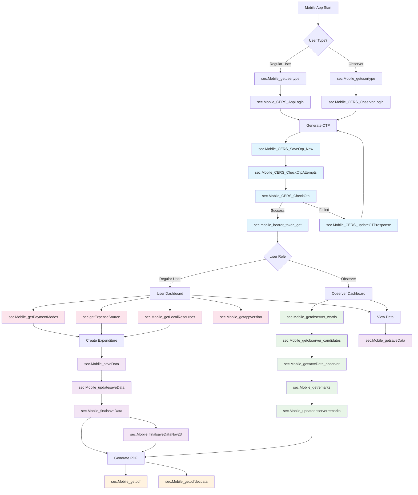

Based on my analysis of the CERS Web API codebase, here are all the stored procedures that are called throughout the application:

## Complete List of Stored Procedures in CERS Web API

### Authentication & User Management
1. **`sec.Mobile_CERS_AppLogin`** - User login authentication
2. **`sec.Mobile_CERS_ObservorLogin`** - Observer login authentication
3. **`sec.Mobile_CERS_SaveOtp`** - Save OTP for verification
4. **`sec.Mobile_CERS_SaveOtp_New`** - Save OTP (new version)
5. **`sec.Mobile_CERS_CheckOtp`** - Verify OTP
6. **`sec.Mobile_CERS_CheckOtpAttempts`** - Check OTP attempt count
7. **`sec.Mobile_CERS_updateOTPresponse`** - Update OTP response
8. **`sec.Mobile_getusertype`** - Get user type information
9. **`sec.mobile_bearer_token_get`** - Generate bearer token

### Expenditure Management
10. **`sec.Mobile_saveData`** - Save expenditure data
11. **`sec.Mobile_updatesaveData`** - Update expenditure data
12. **`sec.Mobile_finalsaveData`** - Final save of expenditure data
13. **`sec.Mobile_finalsaveDataNov23`** - Final save (November 2023 version)
14. **`sec.Mobile_getsaveData`** - Get saved expenditure data
15. **`sec.Mobile_getsaveData_observer`** - Get expenditure data for observer

### Observer Functions
16. **`sec.Mobile_getobserver_wards`** - Get observer wards
17. **`sec.Mobile_getobserver_candidates`** - Get observer candidates
18. **`sec.Mobile_updateobserverremarks`** - Update observer remarks
19. **`sec.Mobile_getremarks`** - Get remarks/comments

### Reference Data
20. **`sec.Mobile_getPaymentModes`** - Get payment modes
21. **`sec.getExpenseSource`** - Get expense sources
22. **`sec.Mobile_getLocalResources`** - Get local resources

### PDF & Document Management
23. **`sec.Mobile_getpdf`** - Get PDF documents
24. **`sec.Mobile_getpdfdecdata`** - Get PDF declaration data

### App Management
25. **`sec.Mobile_getappversion`** - Get application version information

## Schema Information
All stored procedures are in the **`sec`** schema, indicating they are part of the security/application layer of the database.

## Usage Patterns
- Most procedures follow the naming convention `Mobile_[Action][Entity]`
- Procedures are called through the `DBAccess` class methods (`getDBData`, `getDBDataSet`)
- The application uses both single connection (`DBConn`) and alternative connection (`DBConn1`) strings
- Parameters are passed using `SqlParameter` objects with `@` prefix

This comprehensive list includes all stored procedures referenced in the CERS Web API codebase across Controllers, ASPX pages, and the data access layer.

## Stored Procedure Flow Diagram

## Process Flow Description

### 1. Authentication Flow
- User opens app → Check user type → Login (App/Observer) → Generate OTP → Verify OTP → Get Bearer Token

### 2. Regular User Flow
- Dashboard → Load reference data (Payment modes, Expense sources, Local resources) → Create expenditure → Save → Update → Final submit

### 3. Observer Flow  
- Dashboard → Get observer wards → Get candidates → View expenditure data → Add/Update remarks

### 4. PDF Generation Flow
- Triggered after final submission or observer review → Generate PDF documents and declaration data

### 5. Data Management Flow
- Continuous data retrieval and updates throughout the application lifecycle